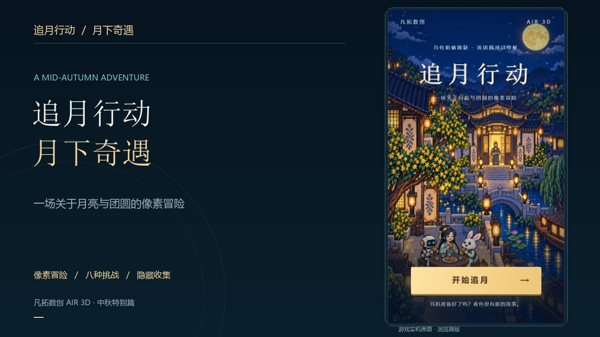
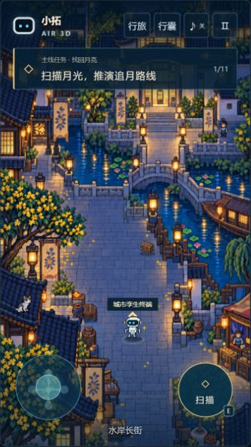
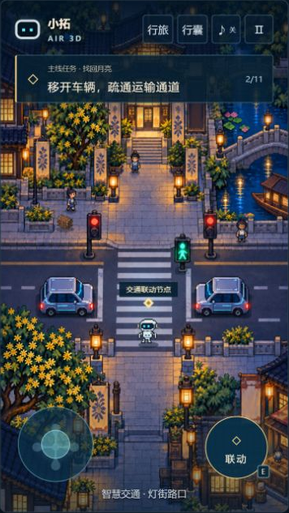
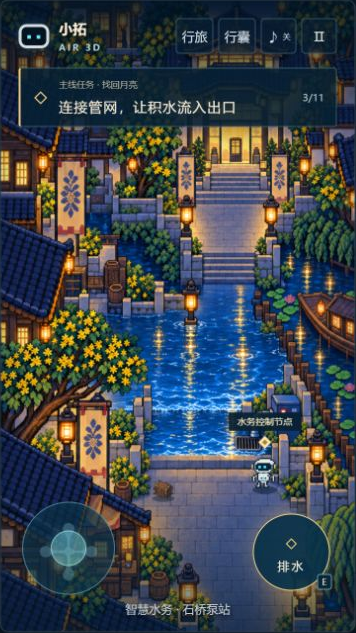
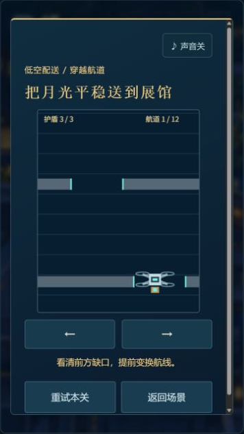

# 追月行动 · 月下奇遇

**Moon Chase Adventure** · 一场关于月亮与团圆的像素冒险。

今晚，月亮不见了。跟随小机器人「小拓」穿过灯火水岸，走进博物馆，解开一个关于团圆的心愿。探索八处场景，挑战八种小游戏，在不起眼的角落收集隐藏食材，让天上与画里都拥有一轮明月。

[](docs/media/moon-chase-trailer.mp4)

**[观看 / 下载游戏宣传片](docs/media/moon-chase-trailer.mp4)** · 约 47 秒 · 1280 × 720 · MP4 · 约 3.2 MB

影片采用浏览器中的实际游戏画面，配上游戏主主题音乐与操作音效。GitHub 页面若未直接播放，可以下载 MP4 观看。

## 游戏亮点

- **八处场景，自由探索**：水岸长街、智慧交通、水务泵站、博物馆前庭与展馆、工厂、装配区、起降露台。已到访的场景可以随时回去。
- **八种不同挑战**：障碍贪吃蛇、车阵华容道、旋转管网、文博问答、能源推箱、联动电路、无人机避障、反射镜光路。
- **角色与故事**：与嫦娥、玉兔、吴刚和画中孩子相遇，通过对话与选择推进故事。
- **隐藏收集与重玩**：寻找八味月饼食材，解锁额外剧情；通关后继续探索，在「行旅」中重玩挑战、刷新最佳成绩。
- **完整视听体验**：五首背景音乐、25 种音效、开场及任务完成动画。视频载入时显示首帧封面。
- **电脑与手机操作**：键盘、点击行走与触屏摇杆；进度自动保存在当前浏览器。

## 实机截图

以下均来自实际运行的游戏，点击可查看原图。

| 水岸长街 · 探索 | 智慧交通 · 城市联动 | 智慧水务 · 修复管网 |
| :---: | :---: | :---: |
| [](docs/media/city.png) | [](docs/media/traffic.png) | [](docs/media/water.png) |

| 文博问答 · 随机题库 | 无人机 · 穿越航道 | 月下相逢 · 角色对话 |
| :---: | :---: | :---: |
| [](docs/media/quiz.png) | [](docs/media/flight.png) | [](docs/media/dialogue.png) |

[更多截图与宣传素材说明](docs/PROMO.md) · [查看电脑完整界面](docs/media/desktop.jpg)

## 本地运行

准备 **Node.js 24 或更新版本**。可以下载仓库 ZIP 并解压，也可以克隆：

```bash
git clone https://github.com/MyLittleShrimp/Moon-Chase-Adventure-by-LittleShrimp.git
cd Moon-Chase-Adventure-by-LittleShrimp
```

在含有 `package.json` 的目录打开终端：

```bash
npm start
```

打开 **http://localhost:4188/** 即可游玩。项目没有第三方运行依赖，无需先执行 `npm install`，也无需构建。

> 请通过本地服务器打开，避免直接双击 `dist/index.html`。游戏使用 JavaScript ES Modules，需要 HTTP 服务。

手机试玩：让手机与电脑连接同一个局域网，在手机浏览器打开 `http://电脑的局域网IP:4188/`。电脑需要保持服务运行，并允许局域网访问该端口。

## 怎样操作

| 操作 | 电脑 | 手机 |
| --- | --- | --- |
| 移动 | WASD / 方向键；或点击地面 | 拖动左下摇杆；或点击地面 |
| 互动 | 走近目标后按 E / 点击互动按钮 | 点击右下互动按钮 |
| 回访 / 重玩 | 右上角「行旅」 | 右上角「行旅」 |
| 查看收集 | 右上角「行囊」 | 右上角「行囊」 |
| 暂停 | Esc / 暂停按钮 | 暂停按钮 |
| 声音 | ♪ 按钮 | ♪ 按钮 |

贪吃蛇可以选择舒缓或挑战航速。文博问答共 48 题，每轮随机抽 5 题，答对 3 题即可过关，没有倒计时。

存档只保存在当前浏览器，不会同步到其他设备；清除网站数据会清除进度。声音在首次互动后启用，开场播放主主题，其余音乐随机轮换。

## 项目结构

```text
dist/                 可直接部署的游戏源码与完整素材
  index.html          游戏入口
  style.css           响应式界面
  game.js             剧情、交互、存档与流程
  world.js            Canvas 场景绘制
  engine.js           场景、角色移动与存档规则
  puzzles.js          小游戏界面
  rules.js            小游戏规则
  quiz.js             文博题库
  audio.js            音乐与音效
  movies.js           过场动画与载入封面
  assets/             图片、音乐、音效、动画
docs/                 开发、交接、素材说明与实机截图
tests/                规则测试及本地检查工具
server.js             本地启动入口（默认 4188）
static-server.js       静态资源及视频 Range 请求支持
QUIZ_SOURCES.md        题库来源与讲解（含答案）
```

**`dist/` 就是当前项目的源码目录，请保留并提交到仓库。** 该项目采用原生 HTML、CSS、JavaScript 与 Canvas，无前端框架、数据库或构建流程。

## 测试与部署

```bash
npm test
```

当前交付版本通过 39 项自动测试，覆盖移动、存档、小游戏规则、题库、音频队列、视频生命周期与媒体响应。手工验证入口及维护方式见 [开发说明](docs/DEVELOPMENT.md)。

正式部署时，将 **`dist/` 内的内容作为网站根目录**，放到支持静态文件的托管服务即可。`npm start` 仅用于本地预览；本仓库不包含云端账号配置，也不要求购买域名。

## 文档与素材

- [玩家说明](docs/GAME_GUIDE.md)
- [开发说明](docs/DEVELOPMENT.md)
- [项目交接](docs/HANDOFF.md)
- [宣传片与截图](docs/PROMO.md)
- [素材与授权说明](docs/ASSETS.md)
- [文博题库来源](QUIZ_SOURCES.md)（含答案）

本项目尚未指定开源许可证。代码及美术、音乐、音效、影片等素材的授权由各自权利方确定。
